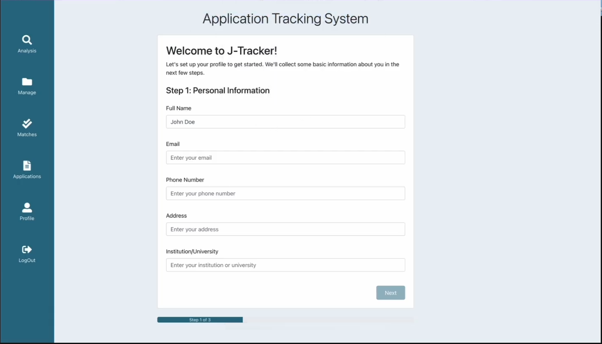
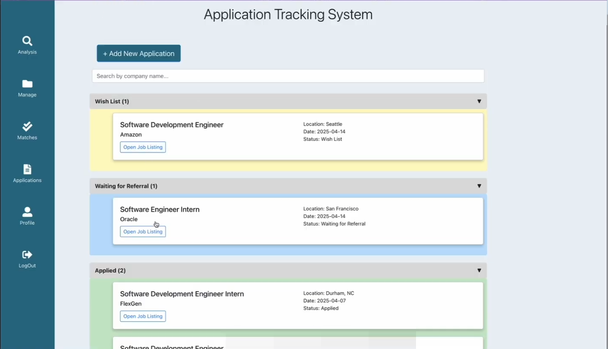

# J-Tracker - Your Job Tracking Assistant

[](https://img.shields.io/badge/python-3670A0?style=for-the-badge&logo=python&logoColor=ffdd54)
	
[](https://github.com/SE-Spring2025-G2/J-Tracker/blob/main/LICENSE)
[](https://zenodo.org/badge/latestdoi/426259091)
[](https://codecov.io/gh/kingan1/application-tracking-system)
[](https://github.com/SE-Spring2025-G2/J-Tracker/issues)
[](https://github.com/SE-Spring2025-G2/J-Tracker/issues?q=is%3Aissue+is%3Aclosed)


[](https://github.com/SE-Spring2025-G2/J-Tracker/network)
[](https://github.com/SE-Spring2025-G2/J-Tracker/stargazers)
[](https://github.com/SE-Spring2025-G2/J-Tracker/graphs/contributors)
[](https://github.com/SE-Spring2025-G2/J-Tracker/graphs/commit-activity)

[](https://github.com/ncsu-csc-510/Project2/graphs/contributors)
[](https://lemon-desert-093c6c80f.2.azurestaticapps.net/)
[](https://victorious-sky-08a81ed0f.2.azurestaticapps.net/)

<!-- <p align="center"></p> -->

The internship application and job application process is no picnic. Job application management is time-consuming. With the referrals and deadlines, the whole process can get daunting. Our app enables you to track and organize your job application process, and manage it, without the inconvenience of clunky Excel spreadsheets.

Our software maintains a record of the work you have wish-listed. It records those companies that you have applied for and records any rejections. Instead of making the user visit each company's website for prospects, our software enables the applicant to look for them directly using simple keywords. Any possible offer of work may then be wish-listed by the applicant.

## New Features in Version 3.0!

🎥[Project2 Demo Video](https://www.youtube.com/watch?v=o2lTHHnvqiY) 

## ⭐ Highlight of Project2 ⭐
### Dockerization 🗃️
Containerizing the application with docker has helped us achieve 2 significant things
1. Dramatically boosting the speed at which one would be able to configure the project in their machines.
2. Automation of the entire run of the application including running the tests!

### ⭐ New AI Features and Updates!
1. Improved scalability and maintainability with optimized querying and restructured user entity fields.
2. AI-driven job matching system leveraging user profiles and resumes for better recommendations.
3. Enhanced profile updates and better resume parsing for accurate job-fit analysis.
4. AI integration for personalized career path suggestions and top opportunity highlights.

#### Bug fixes
1. OAuth Restoration
2. Docker Restoration Repair
3. Authentication into the application randomly not working.
3. Resolved profile update errors and improved system stability and efficiency


---
## Table of contents

- [Basic Design](#basic-design)
- [Samples](#samples)
- [New Features In Phase 3](#new-features-in-phase-3)
- [Future Scope](#future-scope)
- [Explanation](#explanation)
- [Technologies Used](#technologies-used)
- [Installation](#installation)
  - [Requirements](#requirements)
  - [Steps to follow for the installation](#steps-to-follow-for-the-installation)
- [Hosting the Database](#hosting-the-database)
  - [Local MongoDB](#local-mongodb)
  - [Hosted database with MongoDB Atlas](#hosted-database-with-mongodb-atlas)
- [License](#license)
- [How to Contribute](#how-to-contribute)
- [Team Members](#team-members)

## Basic Design:


## Samples:

### Login Page / Signup Page

The introductory visual interface displayed from which a user is able to register and log into the application. User can also login or sign up through Google Authorization.

<p align="center"></p>
The Google Authorization Login:

<p align="center"></p>

After logging in for the first time, the user is presenseted with a welcome screen and given fields to enter their details. They're also given a guided walkthrough of the system to ensure they can make the most out of it.

<p align="center"></p>

### HomeScreen - Profile Page

After Logging In, the Profile page of the user is displayed where the user details such as Name, Institution, email, phone number, address, skills, and more are shown.
Users can add or update information to their profile, such as their personal information, skills, preferred job locations, and their experience level.

<p align="center"></p>

### JobSearchPage 

1. A past analyses column has been added to the dashboard. Here the users will get a summarized version of the comparison between their resume and the job they would like to apply to. 

2. Another feature has been added for ease of use by mentioning a summary of the applications made by each user. The dashboard now shows a count of all the applications as well as the category- Applied, Rejected, Wish List and Waiting for Referral.

3. In the earlier versions of the software the skills were not saved for when the user logs in again. We have solved this bug. Now the users can see their previous preferences after logging in again. They can then update these without any hassle. We have made sure that our database and our code takes care of managing this


<p align="center"></p> 
<p align="center"></p>
<p align="center"></p>
<p align="center"></p>
<p align="center"></p>


### Community-sourced Job Listings

We've introduced a new, collaborative feature to help all of users by making each of them a contributor to the system. Now, when somebody using the application finds a new oppurtunity, it will be recommended to others with a similar profile and interests, allowing more key information to spread faster in the community.

<p align="center"></p>


### ApplicationPage

The user is able to see different saved applications - Waitlisted applications, Waiting for Refereals, Applied Jobs, Application Status. The user is also able to add more jobs to track using this screen.
We've split the entries based on status to let you check how many you have with a quick glance. We also now let you search entries by the company name, meaning you won't have to keep scrolling to find the right one.

<p align="center"></p>


### FinalViewOfDashboard

<p align="center"></p>


## Future Scope:

- Custom tags and notes: Allow users to create custom
tags and attach notes to each job for more personalized
tracking (ex. recruiter contacts, comments, or tasks).
- Profile picture upload: Introduce profile photo support to
personalize user profiles and enhance community
features like networking and referrals.
- Notifications: Enable optional email or in-app reminders
for deadlines, follow-ups, or referral requests to help
users stay on top of every opportunity.
- Resume version management: Enable users to upload
and manage multiple versions of their resume and
associate them with different job applications.
- Prep Space: A community forum where users can share
their interview experience and help others in the process
of applying.


## Technologies Used:

- Python
- Node.Js
- Flask
- MongoDB
- React
- Docker

## Installation:

### Requirements:

- [Python](https://www.python.org/downloads/) (recommended >= 3.8)
- [pip](https://pip.pypa.io/en/stable/installation/) (Latest version 21.3 used as of 11/3)
- [npm](https://nodejs.org/en/) (Latest version 6.14.4 used as of 11/3)
- [Docker-Desktop](https://www.docker.com/products/docker-desktop/) (Latest version as of 11/27)

### Steps to follow for the installation:

1. **Clone the Repository**
    - Use the command `git clone https://github.com/ncsu-csc-510/Project2.git` to clone the repository.

2. **Start the Docker Engine**
    - Ensure that Docker is installed on your system. If not, you can download it from the official Docker website.
    - Start the Docker engine on your machine. The command varies based on your operating system.

3. **Build Images**
    - Navigate to the backend folder and build the image for the API using the following command:
        ```
        docker build -f dockerfile.api -t ats-api .
        ```
    - Similarly, navigate to the frontend folder and build the image for the client using the following command:
        ```
        docker build -f dockerfile.client -t ats-client .
        ```

4. **Run Docker Compose**
    - Finally, run the following command to start the application:
        ```
        docker-compose up
        ```

## Hosting the Database:

### Local MongoDB:

1. Download [MongoDB Community Server](https://docs.mongodb.com/manual/administration/install-community/)
2. Follow the [Installion Guide](https://docs.mongodb.com/guides/server/install/)
3. In app.py set 'host' string to 'localhost'
4. Run the local database:

mongodb

- Recommended: Use a GUI such as [Studio 3T](https://studio3t.com/download/) to more easily interact with the database

### Hosted database with MongoDB Atlas: 

1. [Create account](https://account.mongodb.com/account/register) for MongoDB

- **If current MongoDB Atlas owner adds your username/password to the cluster, skip to step 4** \*

2. Follow MongoDB Atlas [Setup Guide](https://docs.atlas.mongodb.com/getting-started/) to create a database collection for hosting applications
3. Create application.yml in the backend folder with the following content:
   ```
   GOOGLE_CLIENT_ID : <Oauth Google ID>
   GOOGLE_CLIENT_SECRET : <Oauth Google Secret>
   CONF_URL : https://accounts.google.com/.well-known/openid-configuration
   SECRET_KEY : <Any Secret You Want>
   USERNAME : <MongoDB Atlas Username>
   PASSWORD : <MongoDB Atlas Password>
   CLUSTER_URL : <MongoDB Cluster URL>
   ```
4. In app.py set 'host' string to your MongoDB Atlas connection string. Replace the username and password with {username} and {password} respectively
6. For testing through CI to function as expected, repository secrets will need to be added through the settings. Create individual secrets with the following keys/values:
    ```
    MONGO_USER: <MongoDB Atlas cluster username>
    MONGO_PASS: <MongoDB Atlas cluster password>
    ```

## License

The project is licensed under the [MIT](https://choosealicense.com/licenses/mit/) license.

## How to Contribute?

Please see our CONTRIBUTING.md for instructions on how to contribute to the repository and assist us in improving the project.

## Team Members for Version 3.0

- Ayush Gala
- Ayush Pathak
- Keyur Gondhalekar

## Past contributors:
- Anchal Kakadia
- Aniruddha Kulkarni
- Aranya Venugopal

<p align="center">Made with ❤️ on GitHub.</p>